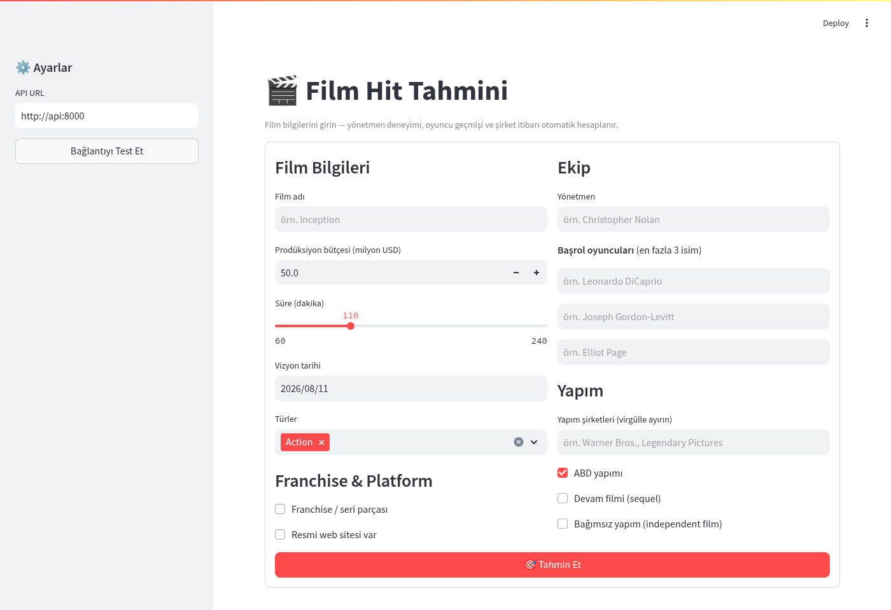

# TMDB Hit Classifier

Box-office hit tahmini için uçtan uca makine öğrenmesi projesi. TMDB 5000 film veri seti kullanılarak bir filmin vizyona girmeden önce **box-office hit olup olmayacağını** tahmin eder.

> **Hit tanımı:** CPI-düzeltmeli gelir (2010 bazlı) / prodüksiyon bütçesi ≥ 2×

📊 [Final sunum (PDF)](assets/tmdb_hit_classifier_final.pdf)



---

## Sonuçlar

| Metrik | Değer |
|--------|-------|
| **F2** | **0.867** |
| **PR-AUC** | **0.921** |
| Recall | 0.882 |
| Precision | 0.811 |
| ROC-AUC | 0.916 |

> Model: `voting_top2` (LightGBM + CatBoost soft voting)
> Test seti: ≥2016 vizyonu, n=72 film — temporal split ile değerlendirildi.

---

## Asıl Çözüm

Reponun tek, bağımsız çalışan **nihai çözümü** kök dizindeki
[`tmdb5000_final.ipynb`](tmdb5000_final.ipynb)'dir — Kaggle'dan ham veri indirmeden
model eğitimine, değerlendirmeye ve canlı tahmin demosuna kadar tüm pipeline'ı tek bir
notebook'ta, açıklamalı adımlarla baştan sona çalıştırır (harici `src/`/`data/`
dosyalarına bağımlı değildir).

`notebooks/` klasörü ise bu çözümün **modüler araştırma geçmişi**dir — aynı pipeline'ın
`preprocess.ipynb` → `eda.ipynb` → `tuning.ipynb` → `modeling.ipynb` olarak ayrı
aşamalara bölünmüş, `src/`'deki paylaşılan modülleri kullanan ve MLflow'a kayıt tutan
hâli. `app/`'deki serving katmanı da `tmdb5000_final.ipynb`'in değil, bu modüler
pipeline'ın (`notebooks/`) ürettiği kayıtlı modeli kullanır.

---

## Proje Yapısı

Proje üç katmandan oluşur: **notebooks/** (araştırma + eğitim), **src/** (yeniden
kullanılabilir pipeline mantığı — notebook'lar tarafından import edilir), **app/**
(serving — notebook'lardaki hiçbir şeye bağımlı değildir, sadece eğitilmiş modeli ve
`src/`'deki birkaç saf fonksiyonu kullanır).

```
.
├── tmdb5000_final.ipynb     # Asıl çözüm — bağımsız, uçtan uca tek notebook
│
├── notebooks/
│   ├── preprocess.ipynb    # Ham veri temizleme ve feature engineering
│   ├── eda.ipynb           # Keşifsel veri analizi
│   ├── tuning.ipynb        # Baseline eğitimi + Optuna hiperparametre tuning
│   └── modeling.ipynb      # Değerlendirme, hibrit modeller, SHAP, feature deneyleri (ana notebook)
│
├── src/                    # Yeniden kullanılabilir modüller
│   ├── modeling.py         # Model eğitimi ve SHAP analizi
│   ├── tuning.py           # Optuna hiperparametre optimizasyonu
│   ├── evaluation.py       # Bootstrap CI, champion tracking, MLflow kayıt
│   ├── ensemble.py         # Voting / Stacking / Blending
│   ├── validation.py       # Temporal split, leakage kontrolü
│   ├── eda_utils.py        # Coverage/constant-feature raporları, temporal aggregation
│   ├── preprocess_utils.py # JSON parsing, encoding, schema inference, winsorize
│   ├── automl.py           # Overfit recovery + toplu tuning orkestrasyonu
│   ├── reporting.py        # MLflow run geçmişinden markdown rapor üretimi
│   └── mlflow_utils.py     # USE_MLFLOW opt-in flag'i — mlflow'suz çalıştırma desteği
│
├── app/                     # Servis katmanı
│   ├── api.py               # FastAPI inference endpoint
│   ├── inference.py         # Ham film verisinden 26 model feature'ının türetilmesi
│   ├── historical_roi.py    # Oyuncu/yönetmen/şirket tarihsel ROI tabloları
│   ├── monitoring.py        # Feature drift (PSI + KS testi)
│   └── ui.py                # Streamlit demo arayüzü
│
├── data/
│   └── tmdb_model.csv       # Model için hazırlanmış veri seti
│
├── docker-compose.yaml      # MLflow + API + UI servisleri
├── Taskfile.yml             # task komutları (make yerine, cross-platform)
└── requirements.txt
```

---

## Nasıl Çalıştırılır

### Gereksinimler

- Python 3.10+
- Docker & Docker Compose (servisleri container'da çalıştırmak için)
- [Task](https://taskfile.dev) — `task` komutu (cross-platform `make` alternatifi)

### Yerel Python ortamı (notebook'lar / geliştirme için)

```bash
python3 -m venv .venv
source .venv/bin/activate          # Windows: .venv\Scripts\activate
pip install -r requirements.txt

# Jupyter'ın bu venv'i kernel olarak görmesi için:
python -m ipykernel install --user --name tmdb-venv --display-name "TMDB venv"
```

### Servisleri Docker ile başlat (önerilen)

```bash
task up-all          # MLflow (5000) + API (8000) + UI (8501)
```

`up-all` Streamlit UI'ı da container olarak başlatır — `http://localhost:8501`
üzerinden erişilebilir, container-içi ağ üzerinden otomatik olarak `api`
servisine bağlanır. Tüm görevleri listelemek için: `task --list-all`.

Tek tek başlatmak için: `task up-mlflow`, `task up-api`, `task up-ui`
(bağımlılık zinciri nedeniyle `up-api` mlflow'u, `up-ui` de api'yi otomatik ayağa kaldırır).

### API / UI'ı Docker olmadan çalıştır (geliştirme)

```bash
task run-api-dev     # --reload ile, http://localhost:8000/docs
task run-ui          # http://localhost:8501 — sidebar'dan API URL girilir
```

`api`, varsayılan olarak repoyla birlikte gelen `models/production` modelini
kullanır — ayrıca bir MLflow sunucusu gerekmez. MLflow registry'den yüklemek
istersen `MODEL_URI=models:/tmdb-hit-classifier/Production` env değişkenini
set et (bu durumda `task up-mlflow` ile bir sunucu ayakta olmalı).

### Notebookları çalıştır (opsiyonel — modeli sıfırdan eğitmek için)

Sırasıyla çalıştırılmalı, her biri bir sonrakinin girdisini üretir:

```bash
notebooks/preprocess.ipynb  # ham veri → data/tmdb_movies_clean.csv + cast/crew/companies/keywords
notebooks/eda.ipynb         # temizlenmiş veri → data/tmdb_model.csv (26 feature)
notebooks/tuning.ipynb      # tuned_models → notebooks/artifacts/tuning_artifacts.joblib
notebooks/modeling.ipynb    # tuning çıktısını yükler, final modeli MLflow Registry'ye kaydeder
```

`tuning.ipynb`/`modeling.ipynb`'deki `USE_MLFLOW` flag'i `False` iken (varsayılan)
hiçbir mlflow sunucusuna bağlanmadan da çalışır — bkz. [Ortam Değişkenleri](#ortam-değişkenleri).

### Ortam Değişkenleri

| Değişken | Varsayılan | Nerede | Açıklama |
|----------|-----------|--------|----------|
| `MODEL_URI` | `models/production` | api | Yüklenecek model — bundled dizin yolu veya `models:/{name}/{stage}` (mlflow registry) |
| `MLFLOW_TRACKING_URI` | `http://localhost:5000` | api, notebooklar | MLflow sunucu adresi (`MODEL_URI` registry URI'ye ayarlıysa kullanılır) |
| `MODEL_STAGE` | `Production` | api | `MODEL_URI` registry URI'ye ayarlıysa yüklenecek stage |
| `PREDICT_THRESHOLD` | `0.5` | api | Hit/miss karar eşiği |
| `MAX_BATCH_SIZE` | `500` | api | `/predict/batch`, `/drift` maksimum satır |
| `DATASET_PATH` | `data/tmdb_model.csv` | api | Drift referans veri seti yolu |
| `API_URL` | `http://localhost:8000` | ui | UI'ın bağlanacağı API adresi |
| `USE_MLFLOW` | `False` | tuning/modeling notebook | `True` → mlflow'a bağlan ve logla; `False` → tamamen atla |

---

## API Endpoint'leri

Servis ayağa kalktıktan sonra Swagger UI: `http://localhost:8000/docs`

| Method | Endpoint | Açıklama |
|--------|----------|----------|
| GET | `/health` | Servis sağlık kontrolü |
| GET | `/info` | Model versiyonu ve konfigürasyon |
| POST | `/predict` | Tek film tahmini |
| POST | `/predict/batch` | Toplu tahmin (maks. 500) |
| POST | `/predict/raw` | Ham, kullanıcı dostu film verisinden tahmin (feature'lar otomatik türetilir) |
| POST | `/drift` | Feature drift raporu (PSI + KS) |

**Örnek istek:**

```bash
curl -X POST http://localhost:8000/predict \
  -H "Content-Type: application/json" \
  -d '{
    "budget_adjusted": 150000000,
    "runtime": 130,
    "is_franchise": 1,
    "is_major_studio": 1,
    "is_summer": 1,
    "genre_Action": 1,
    "num_genres": 2,
    "director_film_count": 5,
    "actor_hist_roi": 2.1,
    "company_hist_roi": 1.8,
    "num_companies": 2,
    "is_us_production": 1,
    "has_homepage": 1,
    "is_holiday": 0,
    "director_collab_count": 20,
    "monthly_franchise_density": 0.4,
    "genre_Adventure": 1,
    "genre_Animation": 0, "genre_Documentary": 0, "genre_Drama": 0,
    "genre_Family": 0, "genre_Fantasy": 0, "genre_Horror": 0,
    "genre_Science Fiction": 0,
    "kw_independent_film": 0, "kw_sequel": 1
  }'
```

---

## Metodoloji

### Temporal Split (Veri Sızıntısı Önleme)

| Bölüm | Yıllar | Film Sayısı |
|-------|--------|-------------|
| Train | ≤ 2013 | 2.899 (%90) |
| Val | 2014–2015 | 255 (%8) |
| Test | ≥ 2016 | 72 (%2) |

`actor_hist_roi`, `director_hist_roi`, `company_hist_roi` feature'ları her film için yalnızca **vizyona giriş öncesindeki** filmlerden hesaplanır — temporal leakage yoktur.

### Feature Engineering (26 Özellik)

| Özellik | Açıklama |
|---------|----------|
| `budget_adjusted` | Filmin prodüksiyon bütçesi. Enflasyona göre düzeltilmiş — 1990'daki 10 milyon dolar ile 2010'daki 10 milyon doları eşit değerde sayar. |
| `runtime` | Filmin süresi (dakika cinsinden). |
| `num_companies` | Filmi birlikte yapan şirket sayısı. Büyük projeler genellikle birden fazla şirketin ortaklığıyla üretilir. |
| `is_major_studio` | Filmin Warner Bros., Universal, Disney, Sony, Paramount veya Fox gibi büyük bir stüdyo tarafından yapılıp yapılmadığı. |
| `is_us_production` | Filmin ABD yapımı olup olmadığı. |
| `has_homepage` | Filmin kendine ait resmi bir web sitesinin olup olmadığı. Pazarlama bütçesinin göstergesi olarak kullanılır. |
| `num_genres` | Filme atanan tür sayısı (örn. hem aksiyon hem macera = 2). |
| `is_franchise` | Filmin bir serinin parçası olup olmadığı (örn. Marvel, Fast & Furious, Harry Potter). |
| `monthly_franchise_density` | Filmin vizyona girdiği ay, rakip franchise filmlerinin yoğunluğu. Yüksekse o ay çok franchise filmi var demektir. |
| `is_summer` | Filmin yaz döneminde (Haziran–Ağustos) vizyona girip girmediği. Yaz, gişe için en rekabetçi ve kârlı dönemdir. |
| `is_holiday` | Filmin tatil döneminde (Kasım–Aralık) vizyona girip girmediği. Yılbaşı sezonu da gişede kritik öneme sahiptir. |
| `director_film_count` | Yönetmenin bu filmden önce çektiği uzun metraj sayısı. Deneyimli yönetmen mi, ilk filmi mi? |
| `director_collab_count` | Yönetmenin kariyeri boyunca birlikte çalıştığı farklı oyuncu ve ekip üyesi sayısı. Geniş bir ağa sahip mi? |
| `actor_hist_roi` | Başrol oyuncusunun önceki filmlerinin ortalama gişe getirisi. Bilet satışlarını artıran bir isim mi? |
| `company_hist_roi` | Yapım şirketinin geçmişteki filmlerinin ortalama gişe getirisi. Hit üretme sicili olan bir şirket mi? |
| `genre_Action` | Film aksiyon türünde mi? |
| `genre_Adventure` | Film macera türünde mi? |
| `genre_Animation` | Film animasyon mu? |
| `genre_Documentary` | Film belgesel mi? |
| `genre_Drama` | Film drama türünde mi? |
| `genre_Family` | Film aile izleyicisine yönelik mi? |
| `genre_Fantasy` | Film fantezi türünde mi? |
| `genre_Horror` | Film korku türünde mi? |
| `genre_Science Fiction` | Film bilim kurgu türünde mi? |
| `kw_independent_film` | Film bağımsız yapım olarak etiketlenmiş mi? Bağımsız filmler genellikle daha düşük bütçeyle üretilir. |
| `kw_sequel` | Film bir önceki filmin devamı mı? Devam filmleri yerleşik bir izleyici kitlesine sahip olur. |

> `actor_hist_roi` ve `company_hist_roi` hesaplanırken yalnızca o filmin **vizyona giriş tarihinden önceki** veriler kullanılır. Böylece model, gelecekteki bilgilere erişmemiş olur.

### Model Seçimi

5 model Optuna ile 100 trial hiperparametre optimizasyonuna tabi tutuldu:

| Model | Val F2 |
|-------|--------|
| **voting_top2** (LightGBM + CatBoost) | **0.847** |
| CatBoost | 0.722 |
| LightGBM | 0.717 |
| XGBoost | 0.718 |
| Logistic Regression | 0.717 |
| Random Forest | 0.711 |

F2 skoru, yanlış negatif (kaçırılan hit) maliyetinin yanlış pozitiften daha yüksek olduğunu yansıtır.

### MLOps

- **MLflow** — deney takibi, model registry, artifact yönetimi (opsiyonel — bkz. `USE_MLFLOW`)
- **Temporal CV** — 8 yıl train / 2 yıl val sliding window ile overfitting tanısı
- **Bootstrap CI** — n=1000 bootstrap ile %95 güven aralığı
- **Drift Monitoring** — PSI + KS two-sample test ile feature drift tespiti

---

## Teknoloji Yığını

| Katman | Teknoloji |
|--------|-----------|
| ML | LightGBM, CatBoost, XGBoost, scikit-learn |
| Tuning | Optuna |
| Tracking | MLflow |
| Serving | FastAPI + Uvicorn |
| UI | Streamlit |
| Infra | Docker Compose, Task |
| Veri | pandas, numpy, scipy |

---

## Değişim Geçmişi

| Versiyon | Özellik Sayısı | Val PR-AUC | Temel Değişiklik |
|----------|---------------|------------|-----------------|
| v14 (final) | 26 | 0.915 | Train cutoff 2009→2013, CPI hit tanımı |
| v13 | 26 | — | `is_english`, `kw_3d` drop |
| v12_simplified | 26 | — | 4 düşük sinyalli feature drop |
| v9_budget_adjusted | 30 | 0.848 | CPI-düzeltmeli bütçe |
| v6_shap_cleaned | 27 | 0.813 | SHAP multikolinearite temizliği |
| v4_univariate_selected | 30 | 0.815 | Bonferroni feature seçimi |

---

## Feature Version History

Her versiyonda yapılan değişiklikler, gerekçeler ve metrik etkileri.

---

### v6_shap_cleaned — ADVBK-61 *(Nisan 2026)*

**Özellik sayısı:** 28 → 27

**Değişiklikler:**
- Çıkarıldı: `relative_budget_score` — SHAP korelasyon analizi: `budget` ile r=0.781, zıt SHAP yönleri (budget ↑hit, relative_budget_score ↓miss) multikolinearite belirtisi

**Gerekçe:** Aynı bilgiyi zıt yönlerle taşıyan iki feature modelde gürültü yaratır; `budget` tek başına yeterli.

| Metrik | v5 (önceki) | v6 | Δ |
|--------|------------|-----|---|
| PR-AUC | 0.8134 | 0.8127 | −0.0007 |
| ROC-AUC | 0.8725 | 0.8693 | −0.0032 |
| F1 | 0.7037 | 0.7139 | +0.0102 |
| Precision | 0.7355 | 0.6848 | −0.0507 |
| Recall | 0.6746 | 0.7456 | +0.0710 |

**Final model:** voting_top2 (logreg + rf)

**Karar:** PR-AUC değişimi gürültü seviyesinde (−0.0007) — drop onaylandı.

---

### v5 *(implicit)* — ADVBK-60 *(Nisan 2026)*

**Özellik sayısı:** 30 → 28

**Değişiklikler:**
- Çıkarıldı: `kw_aftercreditsstinger` (#24, mean_abs=0.0068) — post-release leakage
- Çıkarıldı: `kw_duringcreditsstinger` (#28, mean_abs=0.0012) — post-release leakage

| Metrik | v4 (önceki) | v5 | Δ |
|--------|------------|-----|---|
| PR-AUC | 0.8153 | 0.8134 | −0.0019 |
| ROC-AUC | 0.8736 | 0.8725 | −0.0011 |
| F1 | 0.7163 | 0.7037 | −0.0126 |
| Precision | 0.6701 | 0.7355 | +0.0654 |
| Recall | 0.7692 | 0.6746 | −0.0946 |

**Final model:** blending

---

### v4_univariate_selected — ADVBK-58 + ADVBK-59 *(Nisan 2026)*

**Özellik sayısı:** ~49 → 30

**Yöntem:** Chi-squared (binary) + Mann-Whitney U (continuous), Bonferroni düzeltmesi (p > 0.0010 → drop)

| Metrik | v4 |
|--------|-----|
| PR-AUC | 0.8153 |
| ROC-AUC | 0.8736 |
| F1 | 0.7163 |

**Final model:** voting_top3

---

### v3_new_features — ADVBK-56 *(Nisan 2026)*

**Özellik sayısı:** 41 → 45

**Eklendi:**
- `budget_per_minute` (median $239K/dk)
- `is_franchise` (hit rate %56 vs %32)
- `director_hist_roi` — temporal loop, ROI @p99=72x cap
- `actor_hist_roi` — temporal loop, aynı metodoloji

---

### v1 / v2 — ADVBK-2..5 *(Mart 2026 ve öncesi)*

İlk LGBM overfitting tespiti ve tuning çalışmaları.

---

### Özet Tablosu

| Versiyon | Özellik Sayısı | PR-AUC | Final Model | Temel Değişiklik |
|----------|---------------|--------|-------------|-----------------|
| v14 (final) | 26 | 0.915 | voting_top2 | Train cutoff 2009→2013, CPI hit tanımı |
| v13 | 26 | — | — | `is_english`, `kw_3d` drop |
| v12_simplified | 26 | — | — | 4 düşük sinyalli feature drop |
| v9_budget_adjusted | 30 | 0.848 | — | CPI-düzeltmeli bütçe |
| v6_shap_cleaned | 27 | 0.8127 | voting_top2 | relative_budget_score drop |
| v5 *(implicit)* | 28 | 0.8134 | blending | kw_postcredit ×2 drop (leakage) |
| v4_univariate_selected | 30 | 0.8153 | voting_top3 | Bonferroni + multikolinearite seçimi |
| v3_new_features | 45 | — | — | Temporal feature engineering |
| v1/v2 | ~41 | — | — | LGBM baseline + tuning |
